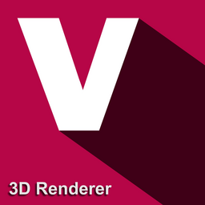

[](https://github.com/ravi688/VulkanRenderer/actions/workflows/c-cpp.yml)
[](https://github.com/ravi688/VulkanRenderer/actions/workflows/msys2.yml)

[&key_width=134)](http://192.168.1.15/gitlab/frameworks-and-libraries/VulkanRenderer/.gitlab-ci.yml)

[&key_width=134)](http://192.168.1.15/gitlab/frameworks-and-libraries/VulkanRenderer/.gitlab-ci.yml)

[&key_width=134)](http://192.168.1.15/gitlab/frameworks-and-libraries/VulkanRenderer/.gitlab-ci.yml)

[&key_width=134)](http://192.168.1.15/gitlab/frameworks-and-libraries/VulkanRenderer/.gitlab-ci.yml)

[&key_width=162)](http://192.168.1.15/gitlab/frameworks-and-libraries/VulkanRenderer/.gitlab-ci.yml)
## Summary

**Vulkan 3D renderer** is built on Vulkan API

But there will be more graphics backend such as OpenGL and DirectX 12 <br>
There are only C and C++ interface headers for now. <br>

<a href="https://www.buymeacoffee.com/raviprakashsingh" target="_blank"></a>

### Tested on

1. Windows 11 64 bit
2. Windows 10 64 bit
3. Nvidia GeForce GTX 1650 4 GB (VRAM) Discrete Mobile GPU + 8 GB of Main Memory (RAM)
4. AMD Radeon(TM) Graphics 512 MB (VRAM) Integratred Mobile GPU + 8 GB of Main Memory (RAM)
5. AMD Vega 8 Graphics 512 MB (VRAM) Integrated Mobile GPU  + 12 GB of Main Memory (RAM)

### Requirements for building on Windows

1. **[Msys2](https://www.msys2.org/)**
2. **Vulkan SDK**

3. **MINGW 11.2.0** (tested on this, but might also work with previous versions), you can check if it is already installed in your machine by running <br>
   
   ```
   $gcc --version
   ```
   
   OR
   
   ```
   $g++ --version
   ```
   
   If this isn't already installed, run the following in MSYS2 MinGW shell
   
   ```
   $pacman -S gcc
   ```

4. **GNU Make 4.3**, you can check if it is already installed, though it already comes with mingw64 binutils package, by running 
   
   ```
   $make --version
   ```
   
   If this isn't already installed, run the following in MSYS2 MinGW shell
   
   ```
   $pacman -S make
   ```

5. **Git version 2.35.1**, git must be installed in your machine, you can check if it is already installed by running <br>
   
   ```
   $git --version
   ```
   
   If this isn't already installed, run the following in MSYS2 MinGW shell
   
   ```
   $pacman -S git
   ```

6. **glslc**, glslc can be installed as follows, run the following in MSYS2 MinGW shell <br>
   
   ```
   $pacman -S mingw-w64-x86_64-shaderc
   ```

### Requirements for building on Linux (Debian)

1. **Vulkan Tools**

   ```
   $sudo apt-get install vulkan-tools
   ```

2. **Vulkan SDK**

   * Download vulkan sdk for linux (debian) from https://www.lunarg.com/vulkan-sdk/
   * Extract the archive by `tar -xvf <archive name>`
   * Change directoy into the extracted folder, usually name as version number `1.x.x.x`
   * Export SDK environment variables, `source ./setup-env.sh`
   * Or you may also just install vulkan-sdk via apt, `sudo apt-get install vulkan-sdk`

3. **GCC 11.2.0** (tested on this, but might also work with previous versions), you can check if it is already installed in your machine by running <br>
   
   ```
   $gcc --version
   ```
   
   OR
   
   ```
   $g++ --version
   ```
   
   If this isn't already installed, run the following in the terminal
   
   ```
   $sudo apt-get install gcc
   ```
   You might also need to install `build-essentials` in case you encounter any standar library header inclusion errors:
   ```
   $sudo apt-get update
   $sudo apt-get install build-essentials
   ```

4. **GNU Make 4.3**, you can check if it is already installed, though it already comes with mingw64 binutils package, by running 
   
   ```
   $make --version
   ```
   
   If this isn't already installed, run the following in the terminal
   
   ```
   $sudo apt-get install make
   ```

5. **Git version 2.35.1**, git must be installed in your machine, you can check if it is already installed by running <br>
   
   ```
   $git --version
   ```
   
   If this isn't already installed, run the following in the terminal
   
   ```
   $sudo apt-get install git
   ```

### Runtime requirements

1. Windows 64 bit
2. GPU supporting vulkan api (integrated or discrete)
3. Main memory (RAM) - No data as of now
4. Disk space - No data as of now
5. Better to have Vulkan LunarG SDK installed for additional debugging and vulkan configuration (validation layers), but it is not a requirement because the static library and headers are already included in the repository and would be updated as new updates will come in future.

### Building steps

1. Clone the repository by running the following command <br>
   
   ```
   $git clone https://github.com/ravi688/VulkanRenderer.git
   ```

2. Change the working directory to `VulkanRenderer` and setup all the dependency git submodules by running the following command
   
   ```
   $cd VulkanRenderer
   $make -s setup
   ```

3. Start building by running the following command
   
   ```
   $make -s build
   ```
   
   OR
   
   ```
   $make -s build-debug
   ```
   
   For release mode
   
   ```
   $make -s build-release
   ```

### Building executable manually (Optional)

1. Change the working directory to `VulkanRenderer` and build the `main` executable by running the following command
   
   ```
   $make -s debug
   ```

2. Now run the `main` executable by running the following command
   
   ```
   $./main
   ```

### Test Run (Optional)
There are several tests which you can try running by just passing arguments:
```
$cd <build directory>
$./main CUBE
```
The above set of commands would launch a window in which a white cube will be spinning.
If you want to see all the possible test cases, you may launch the execution without any arguments and it would just print the list of possible test cases:
```
$./main
supported tests:
        DEPTH_RENDER_TEXTURE
        DEPTH_RENDER_TEXTURE_LOAD
        ENVIRONMENT_REFLECTIONS
        ENVIRONMENT_REFLECTIONS_LOAD
        DEPTH_CUBE_RENDER_TEXTURE
        DEPTH_CUBE_RENDER_TEXTURE_LOAD
        POINT_LIGHT_SHADOWS
        POINT_LIGHT_SHADOWS_LOAD
        SPOT_LIGHT
        SPOT_LIGHT_LOAD
        CUBE
        TEXTURE_SAMPLING
        TEXTURE_SAMPLING_ALPHA_CHANNEL
        TEXT_MESH
        BITMAP_TEXT
        TID_14_CASE_1
        TID_14_CASE_2
        TID_14_CASE_3
        TID_28_CASE_1
        TID_28_CASE_2
        TID_28_CASE_3
        TID_28_CASE_4
        TID_42_CASE_1
        TID_43_CASE_1
        TID_43_CASE_2
        TID_43_CASE_3
        TID_43_CASE_4
        TID_48_CASE_1
        TID_48_CASE_2
        TID_48_CASE_3
        TID_48_CASE_4
        TID_48_CASE_5
```

### Cleaning everything  (Optional)

1. Change the working directory to `VulkanRenderer` and run the following command
   
   ```
   $make -s clean
   ```

## Features

### Multipass Rendering

1. Render Pass Pool to avoid pass duplication
2. Sorting Render Passes using Topological Sort to minimize multiple runs of the same render pass.

### Render Queues

1. Background Render Queue

2. Geometry Render Queue

3. Overlay Render Queue

4. General Purpose Render Queues

### Render Textures  (Hybrid render textures)
A camera can render its depth and color output to a user supplied textures - both at the same time.

1. **Depth Render Texture** <br>
   One can redirect the depth render output of a camera to a depth render texture

2. **Color Render Texture** <br>
   One can redirect the color render output of a camrea to a color render texture

3. **Depth Cube Render Texture (Shadow map for point lights)** <br>
   One can redirect the depth render output of 360 view (6 faces of a cube) to a cube depth render texture - which can further be used as a shadow map for point lights.

4. **Color Cube Render Texture (Environment map for reflection effects)** <br>
   One can redirect the color render output of 360 view (6 faces of a cube) to a cube color render texture - which can further be used as a environment reflection map.

### Textures and Cubemaps

1. Normal Map

2. Albedo Map

3. Skybox &  Reflection cubemap

### Camera System

1. Multiple Cameras

2. Render Target switching

3. Orthographic and Perspective Projection
4. Split rendering

### Lights

1. Directional lights

2. Point lights

3. Spot lights

### Meshes

1. Support for ASCII STL, BINARY STL

2. Support for ASCII OBJ

3. Mesh Trangulation and Quadrangulation

4. Tangent Vector Generation

### Text Mesh Rendering

1. Glyph pool to avoid glyph mesh duplication

2. High performance internal data structure to frequently update the text data

3. Text Mesh batching

### Bitmap Text Rendering
1. Glyph Bitmap Atlas to avoid glyph bitmap duplication
2. Text Layout Callback to customize the placement of glyphs.

### Materials

1. String to fast integer handles for constant lookup

### Shaders

1. Multiple Render passes and Subpasses (fully control over the input and output attachments)

2. Custom attachments configuration

3. Fixed Function pipeline configuration for each pass


## Documentation
The full documentation will be available very soon, however, for now you can have a look at the [Wiki](https://github.com/ravi688/VulkanRenderer/wiki).

## Screenshots and video clips

#### Point Lights

[](https://www.youtube.com/watch?v=V7vfsykNBPY)

#### Spot Lights

[](https://www.youtube.com/watch?v=I390_yvlLE8)

#### Render Textures

[](https://www.youtube.com/watch?v=Ti5y9OSK6Ow)

#### Skybox Rendering

[](https://www.youtube.com/watch?v=f3wqkk3p7MA)

#### Mesh Rendering

[](https://www.youtube.com/watch?v=Jh2ViGbWrrE)

#### Specular Shading

[](https://www.youtube.com/watch?v=nqGjmHLH4jk)

#### Diffuse Shading

[](https://www.youtube.com/watch?v=NQ_kysdMxHg)

#### Color Blending and Text Rendering

[](https://www.youtube.com/watch?v=2jXi0bTWkC4)

#### Flat Shading

[](https://www.youtube.com/watch?v=6K_JPCuZfFM)

## About Me

#### [LinkedIn](https://www.linkedin.com/in/ravi-prakash-singh-095a271a8/)
#### [Github](https://github.com/ravi688)
#### [Medium](https://medium.com/@rp0412204)
#### [Youtube](https://www.youtube.com/channel/UCWe_os3p4z3DBnQ4B5DUTfw/videos)
